# Architecture & Design Document  
## Hệ thống thông tin hỗ trợ quản lý công văn đi và đến tích hợp OCR và chữ ký số


# 1. Giới thiệu chung

## 1.1. Bài toán đặt ra

Trong nhiều cơ quan, đơn vị, quy trình quản lý công văn đi và công văn đến vẫn còn phụ thuộc nhiều vào văn bản giấy, thao tác nhập tay và lưu trữ phân tán. Điều đó dẫn đến các hạn chế:

- Thời gian tiếp nhận và xử lý công văn kéo dài.
- Dễ sai sót khi nhập thủ công.
- Việc tra cứu nội dung công văn còn chậm.
- Công văn giấy và công văn điện tử đang được xử lý tách rời.
- Chữ ký số mới thường được chú trọng ở công văn đi, trong khi công văn đến điện tử lại thiếu bước xác thực đồng bộ.

Đề tài hướng đến việc xây dựng **một hệ thống thông tin hỗ trợ quản lý công văn đi và đến**, trong đó:

- **OCR** được dùng để bóc tách thông tin từ file scan/ảnh công văn.
- **Chữ ký số** được dùng để ký số công văn đi và xác thực công văn điện tử.
- **Cơ sở dữ liệu tập trung** được dùng để lưu trữ, tra cứu và theo dõi luồng xử lý công văn.

---

## 1.2. Mục tiêu của hệ thống

Hệ thống được đề xuất nhằm đạt các mục tiêu sau:

1. Tự động hóa một phần quy trình tiếp nhận, nhập liệu và lưu trữ công văn.
2. Hỗ trợ quản lý đồng thời cả **công văn giấy** và **công văn điện tử**.
3. Tăng tốc độ tra cứu công văn theo metadata và theo nội dung.
4. Tích hợp chức năng OCR cho công văn scan/ảnh.
5. Tích hợp chức năng ký số và kiểm tra chữ ký số.
6. Xây dựng kiến trúc phần mềm rõ ràng, nhẹ, dễ triển khai, phù hợp phạm vi đề tài.
7. Tạo ra một mô hình có thể mở rộng về sau thành hệ thống document intelligence.

---

## 1.3. Phạm vi của hệ thống thử nghiệm

Trong phạm vi đề tài, hệ thống tập trung vào:

- Quản lý danh mục nền tảng:
  - Phòng ban
  - Đơn vị/cơ quan/tổ chức
  - Loại công văn
  - Sổ công văn cấp 1 và cấp 2
- Quản lý công văn đến:
  - Tiếp nhận
  - Kiểm tra mức độ mật
  - Nhập metadata
  - Scan/lưu trữ
  - Chuyển tiếp/phê duyệt
- Quản lý công văn đi:
  - Soạn và nhập thông tin
  - Trình phê duyệt
  - Ký số hoặc đóng dấu
  - Ghi sổ
  - Phát hành/lưu trữ
- Hỗ trợ OCR:
  - Tách text
  - Bóc tách các trường thông tin quan trọng
- Hỗ trợ ký số:
  - Ký số văn bản PDF
  - Kiểm tra hợp lệ chữ ký số
- Tìm kiếm:
  - Theo metadata
  - Theo nội dung OCR/full-text

---

## 1.4. Hướng tiếp cận kiến trúc


- Về mặt logic: chia thành các **mô-đun nghiệp vụ độc lập**.
- Về mặt triển khai trong giai đoạn code và demo: **chọn modular monolith** (một backend nhưng tách module rõ ràng, dùng chung database).
- Các thành phần OCR, ký số, thông báo được thiết kế dưới dạng module tích hợp/worker để **có thể tách service sau này** nếu cần mở rộng.

Cách tiếp cận này giúp:
- Nhóm dễ chia việc.
- Thầy cô dễ đọc, dễ chấm, dễ thấy ranh giới chức năng.
- Hệ thống vẫn có khả năng mở rộng về sau.
- Tránh phức tạp hóa sớm do microservices khi phạm vi đề tài còn ở mức thử nghiệm.

---

## 1.5. Use Case Diagram tổng quan

> Để dễ đọc, sơ đồ Use Case được chia thành 3 nhóm chức năng.

### 1.5.1. Quản lý công văn đến

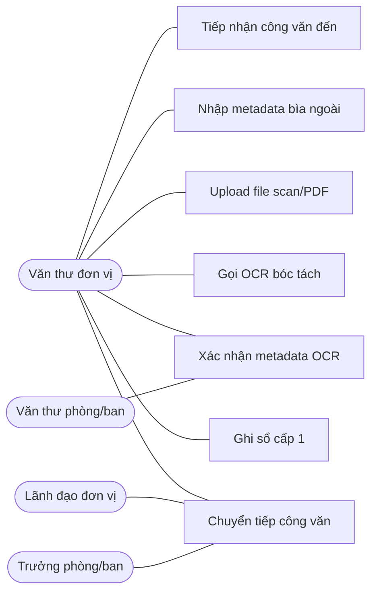

**Mô tả:** Sơ đồ thể hiện quy trình tiếp nhận và xử lý công văn đến. **Văn thư đơn vị** là actor chính, thực hiện toàn bộ chuỗi: tiếp nhận → nhập metadata bìa ngoài → upload file scan → gọi OCR bóc tách tự động → xác nhận kết quả OCR → ghi sổ cấp 1 → chuyển tiếp. **Văn thư phòng/ban** tham gia xác nhận metadata OCR ở cấp phòng ban. **Lãnh đạo đơn vị** và **Trưởng phòng/ban** tham gia quyết định chuyển tiếp công văn cho đúng người/phòng ban xử lý.

### 1.5.2. Quản lý công văn đi

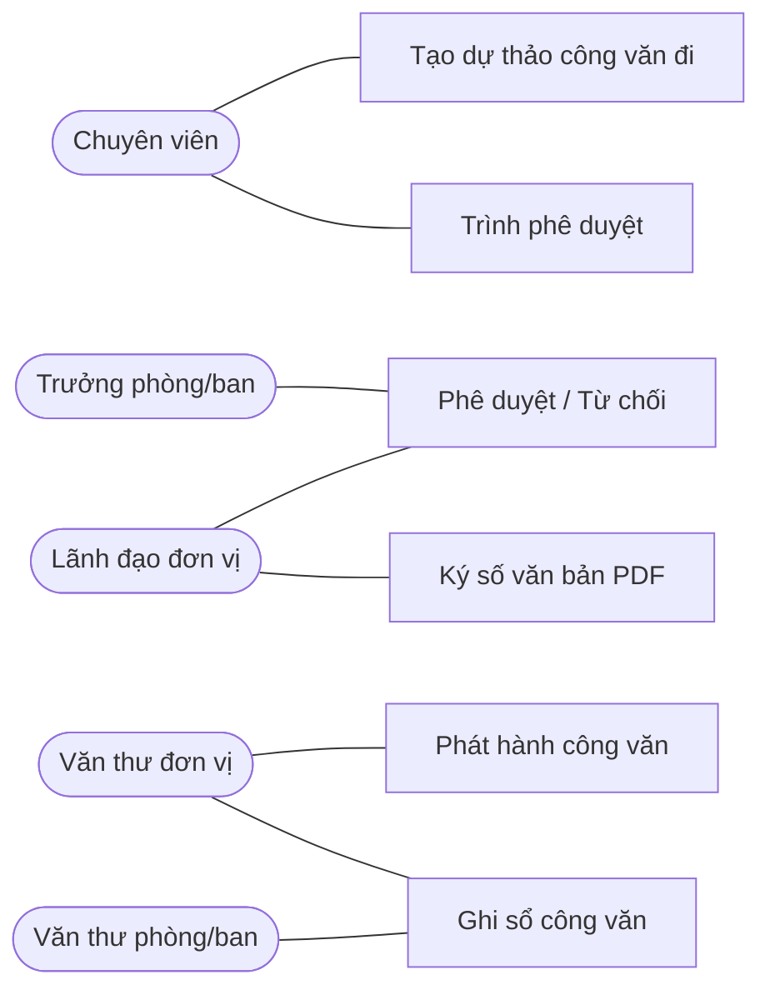

**Mô tả:** Sơ đồ thể hiện quy trình soạn thảo và phát hành công văn đi. **Chuyên viên** khởi tạo dự thảo và trình phê duyệt. **Trưởng phòng/ban** duyệt cấp phòng, **Lãnh đạo đơn vị** duyệt cấp đơn vị và thực hiện ký số văn bản PDF. Sau khi ký, **Văn thư đơn vị** phát hành chính thức và ghi sổ công văn. **Văn thư phòng/ban** phối hợp ghi sổ cấp phòng ban.

### 1.5.3. Chức năng hỗ trợ và quản trị

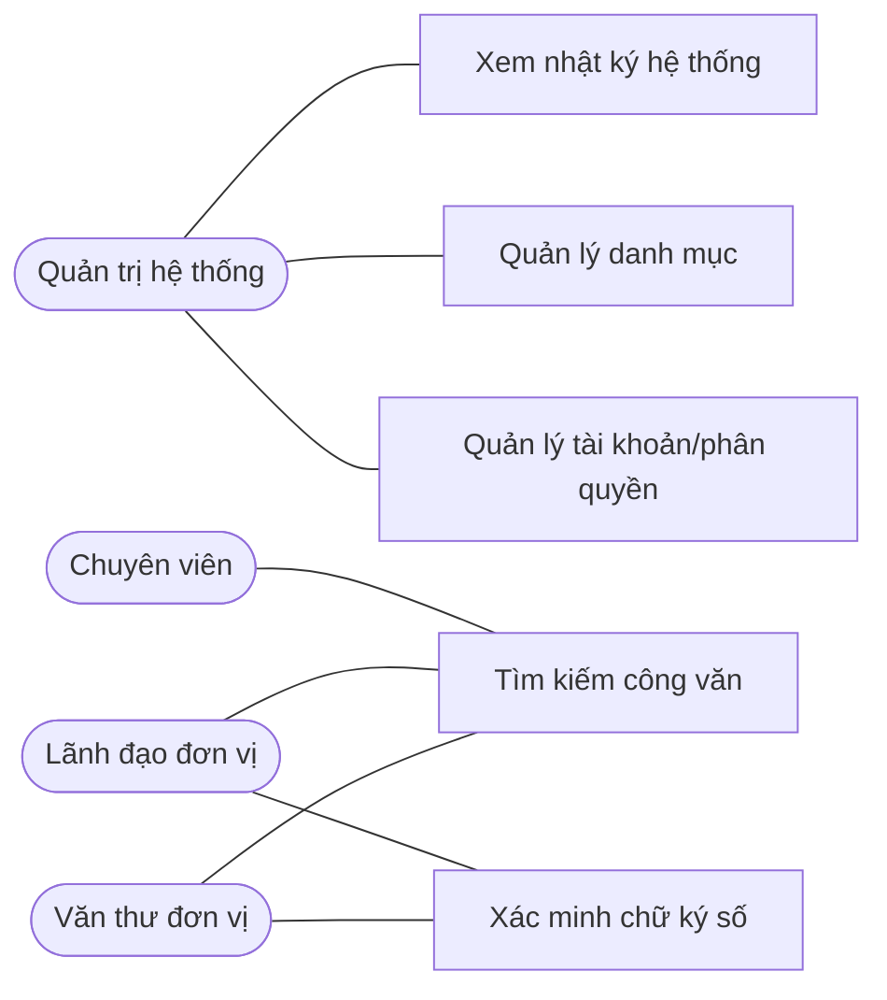

**Mô tả:** Sơ đồ thể hiện các chức năng hỗ trợ và quản trị hệ thống. **Quản trị hệ thống** quản lý tài khoản/phân quyền, danh mục dùng chung và xem nhật ký hoạt động. Chức năng **tìm kiếm công văn** được sử dụng bởi Văn thư, Lãnh đạo và Chuyên viên. Chức năng **xác minh chữ ký số** dùng để kiểm tra tính hợp lệ của công văn điện tử đã ký, được sử dụng bởi Văn thư và Lãnh đạo.

---

# 2. Tác nhân tham gia hệ thống

## 2.1. Vai trò người dùng chính

### 1. Quản trị hệ thống
- Quản lý tài khoản
- Phân quyền
- Quản lý cấu hình dùng chung
- Theo dõi nhật ký hoạt động

### 2. Văn thư đơn vị
- Tiếp nhận công văn đến
- Ghi sổ công văn cấp 1
- Lưu file scan
- Chuyển tiếp công văn
- Phát hành công văn đi ở cấp đơn vị

### 3. Lãnh đạo đơn vị
- Xem công văn đến
- Phê duyệt hướng xử lý
- Duyệt công văn đi
- Ký số hoặc xác nhận trước khi phát hành

### 4. Văn thư phòng/ban
- Ghi sổ công văn cấp 2
- Nhập nội dung chính ở cấp phòng/ban
- Theo dõi công văn được phân tới phòng/ban

### 5. Trưởng phòng/ban
- Nhận công văn được chuyển đến
- Phân công người xử lý
- Theo dõi tiến độ xử lý

### 6. Chuyên viên/nhân sự xử lý
- Xem công văn được giao
- Cập nhật trạng thái xử lý
- Tạo dự thảo công văn đi nếu cần phản hồi

---

## 2.2. Quy tắc phân quyền mức cao

| Vai trò | Xem công văn | Tạo công văn đi | Tiếp nhận công văn đến | OCR | Ký số | Phê duyệt | Quản trị danh mục |
|---|---|---:|---:|---:|---:|---:|---:|
| Quản trị hệ thống | Có | Không bắt buộc | Không bắt buộc | Không bắt buộc | Không | Không | Có |
| Văn thư đơn vị | Có | Có hỗ trợ | Có | Có | Không | Không | Một phần |
| Lãnh đạo đơn vị | Có | Có xem/duyệt | Có xem | Không bắt buộc | Có | Có | Không |
| Văn thư phòng/ban | Có | Có hỗ trợ | Có ở cấp 2 | Có | Không | Không | Một phần |
| Trưởng phòng/ban | Có | Có | Có xem | Không bắt buộc | Có thể | Có | Không |
| Chuyên viên | Có theo phân quyền | Có dự thảo | Không | Không | Không | Không | Không |

---

# 3. Nghiệp vụ cốt lõi của hệ thống

## 3.1. Thông tin chính của một công văn

Mỗi công văn về bản chất cần quản lý các thuộc tính chính sau:

- Đơn vị gửi / người gửi
- Đơn vị nhận / người nhận
- Ngày gửi
- Ngày hết hạn / deadline
- Số hiệu công văn
- Loại công văn
- Nội dung tóm tắt (trích yếu)
- Nội dung chính
- Mức độ mật
- Mức độ khẩn / truyền tải
- File đính kèm (scan, PDF, bản điện tử)
- Tình trạng ký số
- Trạng thái xử lý

---

## 3.2. Các nguyên tắc nghiệp vụ bắt buộc

1. **Công văn mật/tối mật/tuyệt mật**
   - Không được mở phong bì tùy tiện.
   - Chỉ được ghi nhận metadata bìa ngoài theo đúng thẩm quyền.
   - Luồng xử lý phải hạn chế người truy cập.

2. **Sổ công văn**
   - Có 2 cấp:
     - Cấp 1: sổ công văn của đơn vị
     - Cấp 2: sổ công văn của phòng/ban
   - Số công văn đi/đến được đánh tăng dần **trong phạm vi từng sổ và từng năm**.
   - Chu kỳ đánh số được tính lại theo năm.
   - Cấp số phải được thực hiện trong **transaction** và có ràng buộc unique để không trùng số khi nhiều người thao tác đồng thời.
   - Số đã cấp chính thức **không tái sử dụng**. Nếu hồ sơ bị hủy sau khi đã cấp số thì đánh dấu trạng thái số là `CANCELLED` để phục vụ audit.

3. **Công văn đến gửi trực tiếp cho cá nhân**
   - Có thể chỉ thực hiện bước tiếp nhận ban đầu và chuyển trực tiếp cho người nhận.
   - Không nhất thiết mở nội dung nếu không được phép.

4. **Công văn đi**
   - Phải được phê duyệt trước khi phát hành.
   - Phiên bản nào được phê duyệt thì phải **khóa phiên bản đó**; chỉ đúng phiên bản đã duyệt mới được ký số hoặc phát hành.
   - Có thể ký số nếu phát hành điện tử.
   - Phải được ghi sổ cấp 1 trước khi gửi chính thức.
   - Nếu phòng/ban có ghi sổ cấp 2 từ sớm thì bản ghi đó chỉ ở trạng thái `RESERVED`; khi bị hủy thì chuyển `CANCELLED`, không xóa.

5. **OCR**
   - Chỉ là công cụ hỗ trợ bóc tách thông tin.
   - Kết quả OCR phải có bước kiểm tra/hiệu chỉnh lại trước khi chốt lưu dữ liệu chính thức.
   - Mỗi lần OCR lại phải tạo job mới; chỉ **kết quả đã được người dùng chấp nhận** mới được dùng làm dữ liệu chính thức cho tìm kiếm/hiển thị.

6. **Ký số**
   - Không thay thế hoàn toàn nghiệp vụ phê duyệt.
   - Là bước tăng cường tính xác thực, toàn vẹn và chống chối bỏ cho văn bản điện tử.
   - Private key không được lưu thường trú trên server; server chỉ lưu certificate/public key và metadata xác minh.

---

# 4. Kiến trúc tổng thể hệ thống

## 4.1. Quan điểm thiết kế

Kiến trúc đề xuất cần thỏa các yêu cầu:

- Rõ nghiệp vụ, dễ đọc, dễ bảo trì
- Có thể chia việc theo module
- Tách được phần OCR và chữ ký số khỏi phần quản lý công văn
- Dễ nâng cấp về sau
- Phù hợp quy mô một hệ thống thử nghiệm trên nền Web

---

## 4.2. Sơ đồ kiến trúc tổng thể (Component Diagram)

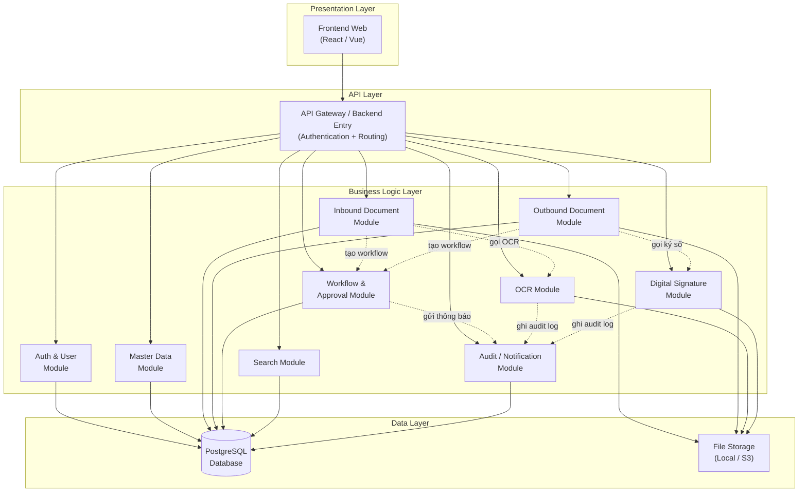

**Chú thích:**
- Mũi tên liền (`-->`) = luồng dữ liệu chính (request → response)
- Mũi tên đứt (`-.->`) = quan hệ phụ thuộc giữa các module (internal call)

---

## 4.3. Mô tả các tầng chính

### 1. Frontend
Chịu trách nhiệm:
- Giao diện nhập liệu
- Hiển thị danh sách công văn
- Xem chi tiết
- Theo dõi trạng thái
- Thực hiện OCR/ký số thông qua API
- Tìm kiếm và báo cáo

### 2. Backend Entry / API Layer
Chịu trách nhiệm:
- Tiếp nhận request từ frontend
- Xác thực người dùng
- Điều phối request vào module tương ứng
- Chuẩn hóa response

### 3. Core Business Modules
Bao gồm các module nghiệp vụ chính:
- quản lý danh mục
- công văn đến
- công văn đi
- luồng xử lý
- OCR
- chữ ký số
- tìm kiếm
- nhật ký hệ thống

### 4. Data Layer
- **PostgreSQL** lưu dữ liệu nghiệp vụ cấu trúc
- **File Storage** lưu file scan, PDF, file gốc, file đã ký

## 4.4. Quyết định triển khai cho giai đoạn code

Để nhóm có thể bắt đầu code ngay mà không mơ hồ về phạm vi kỹ thuật, tài liệu này **chốt kiến trúc triển khai hiện tại là modular monolith**:

- Một backend chính chứa các module nghiệp vụ.
- Một database PostgreSQL dùng chung.
- OCR và ký số là integration module; có thể chạy cùng backend hoặc worker/process riêng.
- Chỉ khi hệ thống ổn định mới cân nhắc tách OCR/Notification/Signature thành service độc lập.

### Quy tắc nhất quán dữ liệu cốt lõi

1. **`documents` là nguồn dữ liệu trạng thái hiện tại**
   - Các trường như `current_status`, `current_department_id`, `current_assignee_user_id`, `approved_version_id`, `accepted_ocr_result_id`, `issued_file_id` được dùng để query nhanh và dựng dashboard.
   - Các bảng `workflow_steps`, `approvals`, `ocr_jobs`, `digital_signatures` là **lịch sử sự kiện**, không phải nguồn trạng thái hiện tại cạnh tranh với `documents`.

2. **Mọi thao tác đổi trạng thái phải chạy trong một transaction**
   - Ví dụ: duyệt công văn đi phải đồng thời ghi `approval`, tạo `workflow_step`, cập nhật `documents.current_status`, cập nhật `approved_version_id`, ghi `audit_log`.

3. **Tác vụ bất đồng bộ không được ghi đè mù**
   - OCR job hoặc ký số job chỉ được cập nhật vào `documents` nếu job đó vẫn còn hợp lệ với file/version hiện tại.
   - Nếu người dùng đã upload file mới hoặc submit version mới, kết quả job cũ chỉ lưu lịch sử, không được overwrite trạng thái hiện tại.

4. **Lịch sử xử lý là append-only**
   - Không sửa record workflow/approval cũ để “chữa dữ liệu”.
   - Nếu có thay đổi, tạo record mới và cập nhật trạng thái hiện tại ở bảng `documents`.

---

# 5. Đề xuất mô-đun / service của hệ thống

## 5.1. Auth & User Module

### Chức năng
- Đăng nhập
- Đăng xuất
- Quản lý người dùng
- Phân quyền
- Gắn người dùng với phòng/ban

### Dữ liệu quản lý
- users
- roles
- user_roles
- departments

### Vai trò
Đây là mô-đun nền tảng để toàn bộ luồng nghiệp vụ xác định:
- ai được xem
- ai được sửa
- ai được phê duyệt
- ai được ký số

---

## 5.2. Master Data Module

### Chức năng
- Quản lý danh mục phòng ban
- Quản lý danh mục đơn vị/cơ quan/tổ chức
- Quản lý loại công văn
- Quản lý mức độ mật
- Quản lý mức độ khẩn
- Quản lý sổ công văn

### Ý nghĩa
Đây là module cung cấp dữ liệu chuẩn hóa cho toàn hệ thống, giúp tránh nhập liệu tự do gây sai lệch.

---

## 5.3. Inbound Document Module (Công văn đến)

### Chức năng chính
- Tiếp nhận công văn đến
- Nhập metadata từ bìa ngoài
- Kiểm tra mức độ mật
- Ghi sổ cấp 1
- Nếu phù hợp, mở file/scan để OCR
- Chuyển tiếp cho lãnh đạo hoặc phòng/ban
- Gán phòng/ban hoặc người xử lý hiện tại
- Lưu trạng thái xử lý

### Trạng thái tiêu biểu
- mới tiếp nhận
- chờ nhập chi tiết
- chờ OCR
- đã OCR
- chờ phê duyệt hướng xử lý
- đã chuyển xử lý
- đã từ chối tiếp nhận
- đã lưu trữ

### Giá trị thực tiễn
Đây là module phản ánh sát nhất quy trình văn thư thực tế.

---

## 5.4. Outbound Document Module (Công văn đi)

### Chức năng chính
- Tạo dự thảo công văn đi
- Nhập thông tin cơ bản
- Quản lý phiên bản dự thảo
- Chọn phương thức phát hành (`PAPER` / `ELECTRONIC`)
- Ghi sổ cấp 2 ở mức `RESERVED` (nếu đơn vị áp dụng)
- Trình lãnh đạo phê duyệt
- Khóa phiên bản đã duyệt
- Thực hiện ký số hoặc hoàn thiện bản giấy
- Ghi sổ cấp 1 ở mức chính thức (`OFFICIAL`)
- Lưu file phát hành cuối cùng
- Theo dõi trạng thái gửi

### Trạng thái tiêu biểu
- dự thảo
- chờ trưởng phòng duyệt
- chờ lãnh đạo duyệt
- chờ ký số
- chờ phát hành bản giấy
- đã ký số
- đã phát hành
- đã gửi
- đã lưu trữ

---

## 5.5. Workflow & Approval Module

### Chức năng
- Quản lý luồng xử lý công văn
- Ghi nhận từng bước chuyển tiếp
- Ghi nhận ý kiến phê duyệt
- Gán người xử lý
- Theo dõi deadline
- Duy trì đúng **một assignment đang hiệu lực** tại mỗi thời điểm cho luồng chính

### Tại sao cần tách riêng
Nếu không tách module workflow thì dữ liệu công văn chỉ cho biết “có công văn”, nhưng không phản ánh được:
- ai đã nhận
- ai đã duyệt
- duyệt lúc nào
- đã chuyển cho ai
- bị từ chối vì lý do gì

Module này chính là xương sống của quá trình điều phối.

### Nguyên tắc triển khai
- `workflow_steps` là lịch sử append-only.
- `assignments` lưu lịch sử giao việc; chỉ một bản ghi có trạng thái `ACTIVE` cho mỗi công văn tại một thời điểm.
- `documents.current_department_id` và `documents.current_assignee_user_id` là ảnh chụp hiện tại để query nhanh.

---

## 5.6. OCR Module

### Chức năng
- Nhận file scan/ảnh/PDF ảnh
- Tiền xử lý ảnh
- Chạy OCR
- Sinh text thô
- Bóc tách metadata
- Trả kết quả cho người dùng xác nhận

### Chuỗi xử lý
```text
File scan/PDF -> Tiền xử lý ảnh -> OCR text -> Bóc tách trường -> Người dùng kiểm tra -> Lưu DB
```

### Các trường cần bóc tách ưu tiên
- số ký hiệu
- ngày văn bản
- trích yếu
- nơi gửi
- nơi nhận
- loại văn bản
- mức độ khẩn (nếu có)
- mức độ mật (nếu có)

### Ghi chú
Trong hệ thống thử nghiệm, nên coi OCR là **hỗ trợ bán tự động**, không nên mô tả là hoàn toàn chính xác 100%.

### Xử lý lỗi và cơ chế retry

OCR là bước có xác suất lỗi cao nhất trong hệ thống, do phụ thuộc vào chất lượng file đầu vào. Cần xử lý:

| Tình huống lỗi | Cách xử lý |
|---|---|
| File ảnh mờ, nghiêng, nhiễu | Tiền xử lý (deskew, denoise, binarization) trước khi OCR |
| OCR engine timeout (file quá lớn) | Đặt timeout tối đa (ví dụ 60s), trả về trạng thái `OCR_TIMEOUT` |
| OCR engine trả kết quả rỗng | Đánh dấu `OCR_FAILED`, cho phép người dùng nhập metadata thủ công |
| Confidence score quá thấp (< ngưỡng) | Cảnh báo người dùng kiểm tra lại, không tự động chấp nhận |
| OCR engine không khả dụng | Retry tối đa 3 lần, sau đó đánh dấu `OCR_SERVICE_UNAVAILABLE` |

Các trạng thái của `ocr_jobs.status`:
```text
PENDING -> PROCESSING -> COMPLETED / FAILED / TIMEOUT / SERVICE_UNAVAILABLE
```

Nguyên tắc quan trọng:
- OCR thất bại **không được chặn luồng nghiệp vụ chính**. Người dùng luôn có thể nhập thủ công.
- Mỗi lần retry phải tạo `ocr_job` mới, không ghi đè job cũ, để giữ lịch sử.

### Xử lý OCR hàng loạt (Batch OCR)

Khi đơn vị tiếp nhận nhiều công văn cùng lúc (ví dụ 20–50 công văn trong một buổi sáng), cần hỗ trợ OCR hàng loạt:

**Chiến lược xử lý:**
- Sử dụng **hàng đợi (queue)** để xếp hàng các OCR job, tránh quá tải OCR engine.
- Giới hạn số job OCR chạy đồng thời (concurrency limit), ví dụ tối đa 3–5 job cùng lúc.
- Mỗi job OCR vẫn là một `ocr_job` riêng biệt, xử lý bất đồng bộ.
- Frontend hiển thị trạng thái từng job: `PENDING → PROCESSING → COMPLETED/FAILED`.

**Luồng Batch OCR:**
```text
Văn thư upload N file → Hệ thống tạo N ocr_jobs (status = PENDING)
→ Queue worker lấy từng job → Chạy OCR → Cập nhật kết quả
→ Văn thư xem trạng thái từng file và xác nhận metadata
```

**Giao diện gợi ý:**
- Màn hình danh sách OCR jobs với bộ lọc theo trạng thái.
- Nút "OCR tất cả file chưa xử lý" để batch submit.
- Progress indicator cho từng job.

---

## 5.7. Digital Signature Module

### Chức năng
- Ký số PDF
- Xác minh chữ ký số
- Kiểm tra tính toàn vẹn của văn bản
- Lưu thông tin ký số và kết quả xác minh

### Chuỗi xử lý khái quát
```text
Phiên bản đã duyệt -> Hash nội dung -> Ký bằng private key -> Sinh chữ ký số -> Gắn vào PDF / lưu kết quả
```

### Ý nghĩa
- Bảo đảm người ký là người đã được cấp chứng thư số
- Nếu nội dung bị sửa sau khi ký, việc xác minh sẽ thất bại
- Hỗ trợ chống chối bỏ

### Quản lý chứng thư số (Certificate)

Hệ thống cần quản lý vòng đời certificate:

1. **Ai upload certificate?**
   - Quản trị hệ thống upload certificate cho lãnh đạo/người có thẩm quyền ký.
   - Hoặc người dùng tự upload certificate cá nhân (tùy chính sách đơn vị).

2. **Lưu trữ:**
   - Certificate (public key) lưu trong bảng `certificates`.
   - Private key **không lưu trên server** — ký số thực hiện qua trình duyệt plugin, USB Token, hoặc HSM.
   - Trong bản demo: có thể mô phỏng bằng file `.pem`/`.pfx` lưu local.

3. **Kiểm tra hợp lệ khi ký:**
   - Certificate còn hạn không? (`valid_from`, `valid_to`)
   - Certificate đã bị thu hồi chưa? (`is_revoked`)
   - Certificate có khớp với user đang đăng nhập không?
   - File cần ký có đúng là file thuộc `approved_version_id` hiện tại không?

4. **Xử lý lỗi ký số:**

| Tình huống | Cách xử lý |
|---|---|
| Certificate hết hạn | Từ chối ký, thông báo gia hạn |
| Certificate bị thu hồi | Từ chối ký, thông báo quản trị |
| File PDF bị lỗi khi gắn chữ ký | Rollback trạng thái về "Chờ ký số" |
| Hash mismatch (file bị sửa sau duyệt) | Từ chối ký, yêu cầu duyệt lại |

### Quy tắc bắt buộc khi code
- Khi lãnh đạo duyệt cấp cuối, hệ thống chốt `documents.approved_version_id`.
- Từ thời điểm đó, nếu nội dung/file thay đổi thì phải tạo `document_version` mới và quay lại luồng duyệt.
- `digital_signatures` phải ghi nhận cả file nguồn trước ký và file đã ký sau ký để truy vết.

---

## 5.8. Search Module

### Chức năng
- Tìm kiếm theo metadata
- Tìm kiếm theo nội dung OCR
- Lọc theo thời gian, loại công văn, đơn vị gửi/nhận, mức độ mật, trạng thái

### Cách triển khai
- Giai đoạn demo: dùng PostgreSQL full-text search hoặc LIKE + index
- Giai đoạn nâng cao: có thể dùng Elasticsearch/OpenSearch

---

## 5.9. Audit / Notification Module

### Chức năng
- Ghi log hành động quan trọng
- Theo dõi ai sửa gì, lúc nào
- Gửi thông báo khi:
  - có công văn mới
  - có yêu cầu phê duyệt
  - sắp đến hạn xử lý
  - OCR/ký số thất bại

### Vai trò
Đây là module giúp hệ thống có tính quản trị và dễ kiểm tra khi bảo vệ.

### Cơ chế gửi thông báo

**Kênh gửi:**
- In-app notification (hiển thị trên giao diện Web) — **bắt buộc**
- Email notification — tùy chọn, nếu cấu hình SMTP

**Cách triển khai:**
- Giai đoạn demo: polling định kỳ (frontend gọi API mỗi 15–30 giây)
- Giai đoạn nâng cao: WebSocket hoặc Server-Sent Events (SSE) cho real-time

**Phân loại thông báo:**

| Loại | Ví dụ | Mức ưu tiên |
|---|---|---|
| `ASSIGNMENT` | Bạn được phân công xử lý công văn #123 | Cao |
| `APPROVAL_REQUEST` | Công văn #456 cần bạn phê duyệt | Cao |
| `DEADLINE_WARNING` | Công văn #789 sắp đến hạn xử lý (còn 1 ngày) | Cao |
| `STATUS_CHANGE` | Công văn #123 đã được phát hành | Trung bình |
| `SYSTEM_ERROR` | OCR thất bại cho công văn #321 | Trung bình |
| `INFO` | Công văn mới được tiếp nhận | Thấp |

### Luồng tạo thông báo trong workflow

Sequence diagram dưới đây mô tả **khi nào** hệ thống tự động tạo notification trong quá trình xử lý công văn:

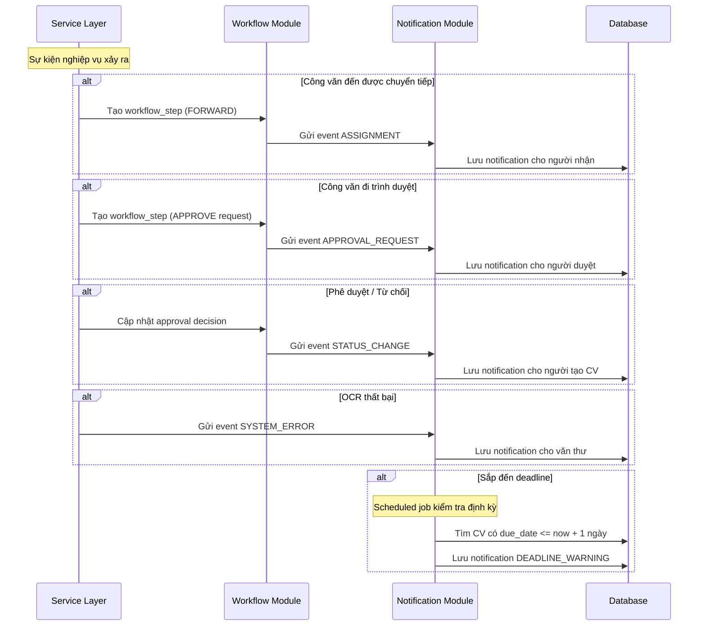

**Quy tắc tạo notification:**

| Sự kiện | Loại notification | Người nhận |
|---|---|---|
| Công văn đến chuyển tiếp | `ASSIGNMENT` | Người/phòng ban được chuyển đến |
| Trình duyệt công văn đi | `APPROVAL_REQUEST` | Trưởng phòng / Lãnh đạo |
| Phê duyệt / Từ chối | `STATUS_CHANGE` | Người tạo dự thảo |
| Ký số thành công | `STATUS_CHANGE` | Văn thư đơn vị |
| OCR / Ký số thất bại | `SYSTEM_ERROR` | Người đã trigger hành động |
| Công văn sắp hết hạn | `DEADLINE_WARNING` | Người đang xử lý |
| Công văn mới tiếp nhận | `INFO` | Lãnh đạo đơn vị |

---

# 6. Luồng hoạt động nghiệp vụ chi tiết

# 6.1. Luồng công văn đến

## 6.1.1. Mô tả bằng lời

1. Văn thư đơn vị tiếp nhận công văn đến.
2. Nhập thông tin bìa ngoài:
   - nơi gửi
   - nơi nhận
   - ngày gửi
   - mức độ mật
3. Nếu công văn là mật/tối mật/tuyệt mật:
   - không mở bìa nếu không đúng thẩm quyền
   - chỉ ghi nhận thông tin cần thiết
   - chuyển trực tiếp theo luồng bảo mật
4. Nếu công văn không mật:
   - mở để xem thông tin bên trong
   - scan hoặc upload file
   - OCR bóc tách metadata
   - người dùng xác nhận/chỉnh sửa
   - ghi sổ công văn cấp 1
5. Chuyển lãnh đạo đơn vị quyết định hướng xử lý hoặc chuyển trực tiếp theo thẩm quyền.
6. Nếu chuyển xuống phòng/ban:
   - hệ thống cập nhật `current_department_id` hoặc `current_assignee_user_id`
   - văn thư phòng/ban ghi sổ cấp 2 nếu quy chế đơn vị yêu cầu
   - trưởng phòng/phụ trách tiếp tục phân công xử lý
7. Kết thúc ở trạng thái lưu trữ hoặc hoàn tất xử lý.

---

## 6.1.2. Sequence diagram công văn đến thường

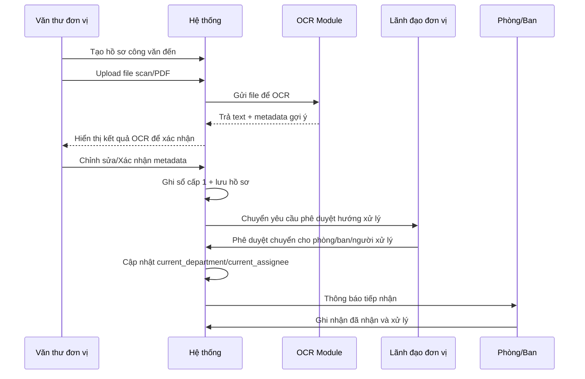

**Mô tả luồng:** Văn thư đơn vị tạo hồ sơ trên hệ thống và upload file scan/PDF. Hệ thống tự động gửi file đến **OCR Module** để bóc tách text và gợi ý metadata (số ký hiệu, ngày, trích yếu...). Kết quả OCR được hiển thị lại cho Văn thư kiểm tra, chỉnh sửa nếu cần, rồi xác nhận. Sau đó hệ thống ghi sổ cấp 1 và chuyển yêu cầu phê duyệt hướng xử lý cho **Lãnh đạo đơn vị**. Khi lãnh đạo duyệt, hệ thống đồng thời tạo workflow step, assignment và cập nhật người/phòng ban đang xử lý hiện tại.

---

## 6.1.3. Sequence diagram công văn mật

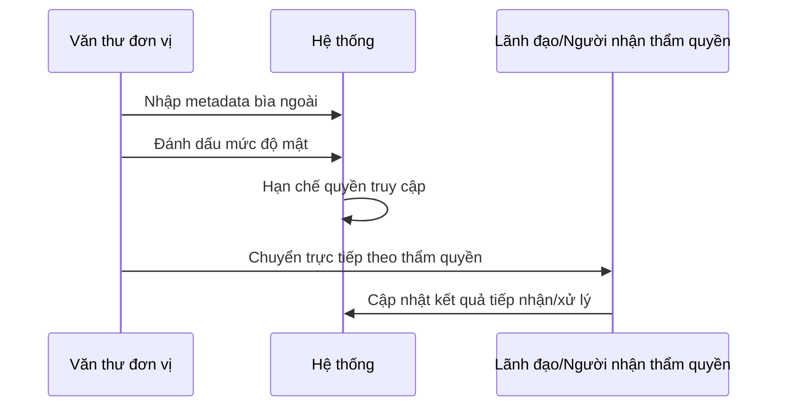

**Mô tả luồng:** Đối với công văn mật/tối mật/tuyệt mật, quy trình được rút gọn để đảm bảo bảo mật. Văn thư đơn vị **chỉ nhập metadata bìa ngoài** (nơi gửi, ngày, mức độ mật) mà không mở nội dung bên trong. Hệ thống tự động hạn chế quyền truy cập theo mức độ mật. Công văn được chuyển **trực tiếp** cho Lãnh đạo hoặc người có thẩm quyền tiếp nhận — không qua bước OCR, không chuyển qua nhiều tầng.

---

# 6.2. Luồng công văn đi

## 6.2.1. Mô tả bằng lời

1. Chuyên viên hoặc phòng/ban tạo dự thảo công văn đi.
2. Nhập:
   - nơi gửi
   - nơi nhận
   - ngày gửi
   - ngày hết hạn
   - loại công văn
   - số hiệu
   - nội dung tóm tắt
   - nội dung chính
   - phương thức phát hành (`PAPER` hoặc `ELECTRONIC`)
3. Hệ thống tạo `document_version` hiện tại.
4. Nếu đơn vị có sổ cấp 2 thì ghi sổ ở trạng thái `RESERVED`.
5. Trình trưởng phòng/lãnh đạo đơn vị phê duyệt.
6. Khi lãnh đạo đơn vị duyệt cấp cuối:
   - hệ thống chốt `approved_version_id`
   - khóa version đã duyệt
7. Nếu phát hành điện tử:
   - chuyển ký số trên đúng file của version đã duyệt
8. Nếu phát hành bản giấy:
   - văn thư hoàn thiện bản giấy/đóng dấu
   - upload file lưu chiểu cuối cùng nếu đơn vị yêu cầu số hóa
9. Văn thư đơn vị ghi sổ cấp 1 chính thức.
10. Lưu file phát hành cuối cùng và đánh dấu đã phát hành.

---

## 6.2.2. Sequence diagram công văn đi

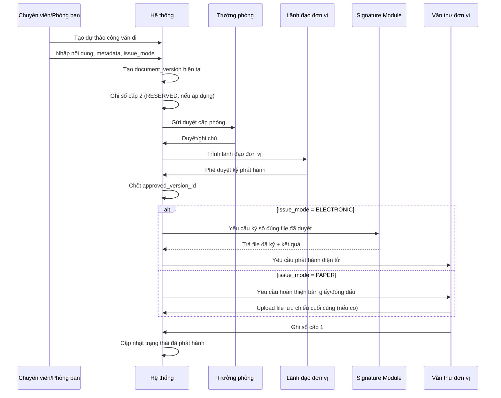

**Mô tả luồng:** Chuyên viên/Phòng ban tạo dự thảo, nhập nội dung, metadata và phương thức phát hành. Hệ thống tạo version hiện tại, có thể ghi sổ cấp 2 ở mức `RESERVED`, rồi gửi cho **Trưởng phòng** duyệt cấp phòng. Sau khi Trưởng phòng duyệt, hệ thống trình lên **Lãnh đạo đơn vị** duyệt cấp đơn vị. Khi lãnh đạo duyệt cấp cuối, hệ thống chốt `approved_version_id`; từ thời điểm này chỉ đúng version đã duyệt mới được ký số hoặc phát hành. Nếu là phát hành điện tử, hệ thống gọi **Signature Module** để ký file đã duyệt. Nếu là bản giấy, **Văn thư đơn vị** hoàn thiện bản phát hành giấy và lưu file cuối cùng để tra cứu. Sau đó văn thư ghi sổ cấp 1 chính thức và hệ thống cập nhật trạng thái "đã phát hành". Nếu bất kỳ cấp nào từ chối, công văn quay về trạng thái dự thảo để chỉnh sửa và tạo version mới.

---

# 7. Thiết kế dữ liệu và cơ sở dữ liệu

## 7.1. Mục tiêu thiết kế dữ liệu

Thiết kế dữ liệu phải đảm bảo:

- Lưu được cả metadata và file đính kèm
- Lưu được lịch sử xử lý
- Lưu được dữ liệu OCR
- Lưu được thông tin ký số/xác minh
- Tách rõ danh mục và dữ liệu nghiệp vụ
- Tối ưu truy vấn tìm kiếm và báo cáo

---

## 7.2. Danh sách bảng lõi đề xuất

## Nhóm bảng người dùng và tổ chức
- `users`
- `roles`
- `user_roles`
- `departments`
- `organizations`

## Nhóm bảng danh mục
- `document_types`
- `confidentiality_levels`
- `priority_levels`
- `document_books`
- `document_book_counters`

## Nhóm bảng công văn
- `documents`
- `document_recipients`
- `document_files`
- `document_versions`
- `document_book_entries`

## Nhóm bảng xử lý luồng
- `workflow_instances`
- `workflow_steps`
- `approvals`
- `assignments`

## Nhóm bảng OCR
- `ocr_jobs`
- `ocr_results`
- `ocr_extracted_fields`

## Nhóm bảng chữ ký số
- `digital_signatures`
- `signature_verifications`
- `certificates`

## Nhóm bảng hỗ trợ
- `search_index` (nếu tự làm search table)
- `notifications`
- `audit_logs`

---

## 7.3. Giải thích một số bảng quan trọng

### `users`
Lưu thông tin tài khoản người dùng hệ thống.

Các cột gợi ý:
- id
- username
- password_hash
- full_name
- email
- department_id
- is_active
- created_at
- updated_at

---

### `departments`
Lưu thông tin phòng/ban trong đơn vị.

Các cột gợi ý:
- id
- code
- name
- parent_department_id (nếu có phân cấp)
- manager_user_id
- created_at
- updated_at

---

### `organizations`
Lưu các đơn vị/cơ quan/tổ chức gửi hoặc nhận công văn.

Các cột gợi ý:
- id
- code
- name
- address
- contact_person
- phone
- email

---

### `document_types`
Lưu loại công văn.

Ví dụ:
- thông báo
- quyết định
- công văn hành chính
- giấy mời
- báo cáo

---

### `document_books`
Lưu sổ công văn.

Các cột gợi ý:
- id
- name
- level (1 hoặc 2)
- department_id (nullable, với cấp 1 có thể null hoặc gắn đơn vị)
- year
- description

---

### `document_book_counters`
Lưu bộ đếm cấp số cho từng sổ công văn theo năm.

Các cột gợi ý:
- id
- document_book_id
- year
- next_number
- updated_at

> Ghi chú triển khai: khi cấp số mới, backend khóa dòng counter bằng `SELECT ... FOR UPDATE` hoặc cơ chế tương đương để tránh trùng số khi nhiều request đồng thời.

---

### `documents`
Đây là bảng trung tâm của hệ thống.

Các cột quan trọng:
- id
- code_number
- title_summary
- content_text
- document_direction (`INBOUND` / `OUTBOUND`)
- issue_mode (`PAPER` / `ELECTRONIC`, nullable với công văn đến)
- sender_org_id
- sender_user_id
- issue_date
- due_date
- document_type_id
- confidentiality_level_id
- priority_level_id
- current_status
- current_department_id
- current_assignee_user_id
- active_workflow_instance_id
- accepted_ocr_result_id
- approved_version_id
- issued_file_id
- created_by
- created_at
- updated_at

Giải thích:
- `document_direction` giúp phân biệt công văn đến và công văn đi.
- `issue_mode` chỉ bắt buộc với công văn đi, quyết định nhánh ký số hay phát hành bản giấy.
- `current_status` là **nguồn trạng thái hiện tại duy nhất** để query nhanh.
- `content_text` có thể là nội dung chính hoặc phần đã được chuẩn hóa.
- Nội dung OCR và file sẽ tách bảng riêng để dễ quản lý.
- **Nơi nhận** không lưu trực tiếp trong bảng `documents` mà được quản lý qua bảng `document_recipients`, cho phép gửi công văn cho **nhiều nơi nhận** mà không bị giới hạn.
- `current_department_id` và `current_assignee_user_id` cho biết hiện hồ sơ đang ở đâu.
- `active_workflow_instance_id` trỏ tới workflow đang hiệu lực.
- `accepted_ocr_result_id` trỏ tới kết quả OCR đã được con người xác nhận.
- `approved_version_id` khóa đúng version đã được duyệt để ký/phát hành.
- `issued_file_id` trỏ tới file phát hành cuối cùng đang có hiệu lực.

---

### `document_files`
Lưu các file liên quan đến công văn.

Các cột gợi ý:
- id
- document_id
- version_id (nullable, FK → `document_versions.id`)
- file_name
- mime_type
- file_path
- file_size
- checksum_sha256
- file_role (`ORIGINAL`, `SCAN`, `DRAFT_PDF`, `FINAL_PDF`, `SIGNED`, `ATTACHMENT`)
- is_encrypted
- uploaded_by
- uploaded_at

> Ghi chú: Với công văn đi, file phát hành cuối cùng phải được trỏ bởi `documents.issued_file_id`; không suy luận bằng cách “lấy file mới nhất”.

---

### `document_book_entries`
Lưu việc ghi sổ công văn.

Các cột gợi ý:
- id
- document_id
- document_book_id
- entry_year
- entry_number
- entry_status (`RESERVED`, `OFFICIAL`, `CANCELLED`)
- entry_date
- summary
- note
- created_by

Một công văn có thể được ghi vào:
- sổ cấp 1
- và/hoặc sổ cấp 2

Ràng buộc quan trọng:
- Unique: (`document_book_id`, `entry_year`, `entry_number`)
- Số `OFFICIAL` không tái sử dụng
- Số `RESERVED` chỉ dùng cho luồng tạm thời; nếu hủy thì chuyển `CANCELLED`

---

### `document_recipients`
Lưu danh sách đơn vị/người nhận công văn. Tách bảng riêng vì một công văn có thể gửi cho nhiều nơi nhận.

Các cột gợi ý:
- id
- document_id
- recipient_type (`ORGANIZATION` / `DEPARTMENT` / `USER`)
- recipient_org_id (nullable)
- recipient_department_id (nullable)
- recipient_user_id (nullable)
- is_primary (đánh dấu nơi nhận chính)
- routing_order
- received_at
- note

> Ghi chú:
> - Bảng này là nơi duy nhất quản lý danh sách nơi nhận công văn. Bảng `documents` không lưu `receiver_org_id` hay `receiver_user_id`.
> - Phải có **CHECK constraint** bảo đảm đúng **một** trong ba cột `recipient_org_id`, `recipient_department_id`, `recipient_user_id` được phép khác `NULL`.
> - Có thể bổ sung unique phù hợp để tránh nhập trùng nơi nhận.

---

### `document_versions`
Lưu lịch sử phiên bản của công văn đi khi dự thảo bị trả lại và chỉnh sửa.

Các cột gợi ý:
- id
- document_id
- version_number
- content_snapshot (nội dung tại thời điểm lưu version)
- checksum_sha256
- version_status (`WORKING`, `SUBMITTED`, `APPROVED`, `SUPERSEDED`)
- change_note (ghi chú thay đổi)
- created_by
- created_at

> Ghi chú:
> - Mỗi khi dự thảo bị reject và chỉnh sửa lại, hệ thống tự tạo version mới. Điều này giúp truy vết "ai sửa gì, lúc nào" khi bảo vệ.
> - Version là **immutable snapshot**; không sửa trực tiếp version đã submit/approved.
> - Các file thuộc version nào thì gắn qua `document_files.version_id` để tránh vòng tham chiếu giữa hai bảng.
> - `documents.approved_version_id` phải luôn trỏ tới version đang được duyệt/phát hành hiện hành.

---

### `workflow_instances`
Mỗi công văn có thể có một hoặc nhiều luồng xử lý.

Các cột:
- id
- document_id
- workflow_type
- started_by
- started_at
- ended_at
- status

> Ghi chú: `documents.active_workflow_instance_id` trỏ tới workflow đang hiệu lực hiện tại; các workflow cũ vẫn được giữ để truy vết.

---

### `workflow_steps`
Lưu từng bước chuyển tiếp.

Các cột:
- id
- workflow_instance_id
- step_order
- from_user_id
- to_user_id
- from_department_id
- to_department_id
- action_type (`FORWARD`, `APPROVE`, `REJECT`, `RETURN`, `ASSIGN`, `SIGN`, `ISSUE`, `ARCHIVE`)
- action_note
- action_time
- result_status (`PENDING`, `COMPLETED`, `CANCELLED`)

Giải thích các `action_type`:

| Giá trị | Ý nghĩa |
|---|---|
| `FORWARD` | Chuyển tiếp công văn cho người/phòng ban khác |
| `APPROVE` | Phê duyệt công văn |
| `REJECT` | Từ chối công văn |
| `RETURN` | Trả lại công văn để chỉnh sửa |
| `ASSIGN` | Phân công người xử lý |
| `SIGN` | Ký số văn bản |
| `ISSUE` | Phát hành công văn |
| `ARCHIVE` | Lưu trữ hồ sơ |

---

### `approvals`
Lưu các lần phê duyệt hoặc từ chối.

Các cột:
- id
- document_id
- workflow_step_id (liên kết với bước workflow tương ứng, tránh mất đồng bộ)
- document_version_id
- approver_user_id
- approval_level (`DEPARTMENT_HEAD` / `UNIT_LEADER`)
- decision (`APPROVED`, `REJECTED`, `RETURNED`)
- note
- approved_at

> Ghi chú quan trọng:
> - `workflow_step_id` là khóa ngoại liên kết phê duyệt với bước workflow cụ thể, giúp giảm nguy cơ mất đồng bộ.
> - `document_version_id` cho biết **chính xác version nào đã được duyệt/từ chối/trả lại**.
> - Tính nhất quán cuối cùng vẫn phải được bảo đảm bằng transaction ở service layer, không chỉ bằng khóa ngoại.

---

### `assignments`
Lưu lịch sử giao việc và người đang xử lý công văn.

Các cột:
- id
- document_id
- workflow_step_id
- assigned_by_user_id
- assigned_to_department_id (nullable)
- assigned_to_user_id (nullable)
- assigned_at
- due_date
- assignment_status (`ACTIVE`, `COMPLETED`, `CANCELLED`, `REASSIGNED`)
- note

> Ghi chú:
> - Có thể giao cho **phòng/ban** hoặc **cá nhân**, tùy bước workflow.
> - Tối thiểu một trong hai cột `assigned_to_department_id`, `assigned_to_user_id` phải khác `NULL`.
> - Tại một thời điểm chỉ nên có **một assignment `ACTIVE`** cho luồng xử lý chính của công văn.
> - `documents.current_department_id` và `documents.current_assignee_user_id` là ảnh chụp hiện tại suy ra từ assignment đang hiệu lực.

---

### `ocr_jobs`
Lưu lịch sử chạy OCR. Mỗi lần retry tạo `ocr_job` mới, không ghi đè job cũ.

Các cột:
- id
- document_id (FK → `documents.id`)
- file_id (FK → `document_files.id` — file scan/ảnh cụ thể được OCR)
- engine_name (ví dụ: `TESSERACT`, `EASYOCR`, `PADDLEOCR`)
- status (`PENDING`, `PROCESSING`, `COMPLETED`, `FAILED`, `TIMEOUT`, `SERVICE_UNAVAILABLE`)
- retry_of_job_id (nullable, FK → `ocr_jobs.id` — nếu đây là lần retry, trỏ về job gốc)
- started_at
- ended_at
- triggered_by (FK → `users.id`)

---

### `ocr_results`
Lưu kết quả text OCR. Mỗi `ocr_job` thành công sẽ tạo đúng một `ocr_result`. Khi retry OCR, job mới sẽ tạo result mới — các result cũ vẫn được giữ nguyên để truy vết.

Các cột:
- id
- ocr_job_id (FK → `ocr_jobs.id`)
- raw_text
- confidence_score
- reviewed_by (FK → `users.id`, nullable)
- reviewed_at
- is_accepted (boolean — chỉ `true` khi người dùng xác nhận kết quả đủ chính xác)

> Ghi chú: Chỉ một `ocr_result` được phép là kết quả chính thức tại một thời điểm; `documents.accepted_ocr_result_id` sẽ trỏ tới bản đã chấp nhận.

---

### `ocr_extracted_fields`
Lưu các trường bóc tách được.

Các cột:
- id
- ocr_result_id
- field_name
- field_value
- confidence_score

Ví dụ:
- `field_name = "code_number"`
- `field_name = "issue_date"`
- `field_name = "title_summary"`

---

### `digital_signatures`
Lưu thông tin ký số.

Các cột:
- id
- document_id
- document_version_id
- source_file_id
- signed_file_id
- signer_user_id
- certificate_id
- signature_algorithm
- hash_algorithm
- source_file_hash_sha256
- signed_at
- signature_status (`PENDING`, `SUCCESS`, `FAILED`, `INVALIDATED`)

---

### `signature_verifications`
Lưu kết quả xác minh chữ ký số.

Các cột:
- id
- signature_id
- verified_by
- verification_time
- verification_result
- verification_note

---

### `audit_logs`
Lưu nhật ký thao tác hệ thống.

Các cột:
- id
- user_id
- entity_type
- entity_id
- action
- old_value
- new_value
- ip_address
- created_at

---

### `certificates`
Lưu thông tin chứng thư số của người dùng.

Các cột:
- id
- user_id
- certificate_serial
- issuer_name
- subject_name
- valid_from
- valid_to
- is_revoked
- certificate_file_path
- uploaded_by
- uploaded_at

---

### `notifications`
Lưu thông báo gửi đến người dùng.

Các cột:
- id
- recipient_user_id
- notification_type (`ASSIGNMENT`, `APPROVAL_REQUEST`, `DEADLINE_WARNING`, `STATUS_CHANGE`, `SYSTEM_ERROR`, `INFO`)
- title
- message
- reference_entity_type (ví dụ: `DOCUMENT`, `APPROVAL`)
- reference_entity_id
- priority (`HIGH`, `MEDIUM`, `LOW`)
- is_read
- read_at
- created_at

---

### Chiến lược xóa dữ liệu (Soft Delete)

Với hệ thống quản lý văn bản chính thức, **không bao giờ xóa cứng** dữ liệu công văn. Các bảng chính (`documents`, `document_files`, `document_versions`) cần bổ sung:

- `is_deleted` (boolean, mặc định `false`)
- `deleted_at` (timestamp, nullable)
- `deleted_by` (user_id, nullable)

Khi "xóa", chỉ đánh dấu `is_deleted = true` và ghi `audit_log`. Dữ liệu vẫn tồn tại để truy vết khi cần.

---

## 7.4. Quan hệ dữ liệu tổng quát (ERD mức logic)

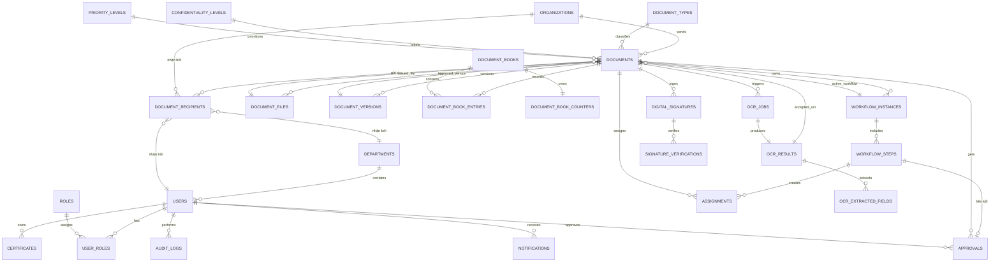

---

## 7.5. Giải thích mối quan hệ quan trọng

### Quan hệ 1: `documents` với `document_files`
- Một công văn có thể có nhiều file:
  - file scan
  - file PDF gốc
  - file đã ký số
  - file đính kèm khác

=> Quan hệ **1 - nhiều**

Ngoài ra, `documents.issued_file_id` trỏ ngược lại **một file phát hành chính thức duy nhất** đang có hiệu lực.

---

### Quan hệ 2: `documents` với `document_book_entries`
- Một công văn có thể được ghi vào nhiều sổ:
  - sổ cấp 1
  - sổ cấp 2

=> Quan hệ **1 - nhiều**

Việc cấp `entry_number` không lấy bằng `MAX + 1` trong code ứng dụng, mà phải đi qua counter/transaction để tránh race condition.

---

### Quan hệ 3: `documents` với `workflow_instances` và `workflow_steps`
- Một công văn có thể có một luồng xử lý chính.
- Mỗi luồng có nhiều bước.

=> `documents` -> `workflow_instances`: **1 - nhiều**  
=> `workflow_instances` -> `workflow_steps`: **1 - nhiều**

`documents.current_status`, `current_department_id`, `current_assignee_user_id` là ảnh chụp trạng thái hiện tại; `workflow_steps` là lịch sử chi tiết để truy vết.

---

### Quan hệ 4: `documents` với `ocr_jobs`
- Một công văn có thể OCR nhiều lần nếu:
  - upload lại file
  - đổi engine OCR
  - chạy lại khi kết quả chưa tốt

=> Quan hệ **1 - nhiều**

Tuy nhiên chỉ **một** kết quả OCR được chấp nhận chính thức tại một thời điểm, được trỏ bởi `documents.accepted_ocr_result_id`.

---

### Quan hệ 5: `ocr_results` với `ocr_extracted_fields`
- Một lần OCR cho ra một khối text thô.
- Từ text đó bóc tách nhiều trường.

=> Quan hệ **1 - nhiều**

---

### Quan hệ 6: `documents` với `digital_signatures`
- Một công văn có thể có nhiều lần ký hoặc nhiều trạng thái ký.
- Tuy nhiên trong bản demo, có thể giới hạn 1 file phát hành cuối cùng tương ứng 1 bản ký chính.

=> Quan hệ **1 - nhiều** ở mức thiết kế, nhưng có thể áp dụng quy tắc nghiệp vụ giới hạn khi demo.

`digital_signatures.document_version_id` giúp chứng minh chữ ký đang gắn với đúng version đã được duyệt.

---

### Quan hệ 7: `documents` với `assignments`
- Một công văn có thể được phân công nhiều lần trong suốt vòng đời xử lý.
- Nhưng tại một thời điểm chỉ nên có **một assignment `ACTIVE`** cho luồng chính.

=> Quan hệ **1 - nhiều**

---

# 8. Trạng thái và vòng đời công văn

## 8.1. Vòng đời công văn đến

```text
Mới tiếp nhận
-> Chờ nhập chi tiết
-> Chờ OCR / Đã OCR
-> Chờ lãnh đạo phê duyệt hướng xử lý
-> Đã chuyển phòng/ban hoặc người nhận
-> Đang xử lý
-> Hoàn tất / Lưu trữ / Từ chối tiếp nhận
```

### State Diagram công văn đến

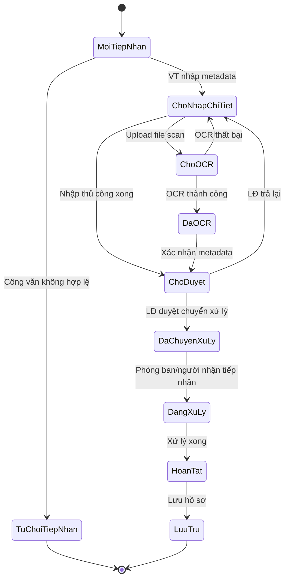

### Bảng quy tắc chuyển trạng thái công văn đến

| Trạng thái hiện tại | Hành động | Trạng thái tiếp theo | Ai thực hiện |
|---|---|---|---|
| Mới tiếp nhận | Nhập metadata bìa ngoài | Chờ nhập chi tiết | Văn thư đơn vị |
| Mới tiếp nhận | Từ chối tiếp nhận | Từ chối | Văn thư đơn vị |
| Chờ nhập chi tiết | Upload file để OCR | Chờ OCR | Văn thư đơn vị |
| Chờ nhập chi tiết | Nhập thủ công xong | Chờ duyệt | Văn thư đơn vị |
| Chờ OCR | OCR thành công | Đã OCR | Hệ thống |
| Chờ OCR | OCR thất bại | Chờ nhập chi tiết | Hệ thống |
| Đã OCR | Xác nhận metadata | Chờ duyệt | Văn thư đơn vị |
| Chờ duyệt | LĐ duyệt chuyển | Đã chuyển xử lý | Lãnh đạo |
| Chờ duyệt | LĐ trả lại | Chờ nhập chi tiết | Lãnh đạo |
| Đã chuyển xử lý | Phòng ban/người nhận tiếp nhận | Đang xử lý | Phòng/Ban hoặc người nhận |
| Đang xử lý | Hoàn tất | Hoàn tất | Chuyên viên |
| Hoàn tất | Lưu hồ sơ | Lưu trữ | Văn thư |

---

## 8.2. Vòng đời công văn đi

```text
Dự thảo
-> Chờ duyệt cấp phòng
-> Chờ duyệt cấp đơn vị
-> Chờ ký số hoặc chờ phát hành bản giấy
-> Đã ký số (nếu điện tử)
-> Đã phát hành
-> Đã gửi
-> Lưu trữ
```

### State Diagram công văn đi

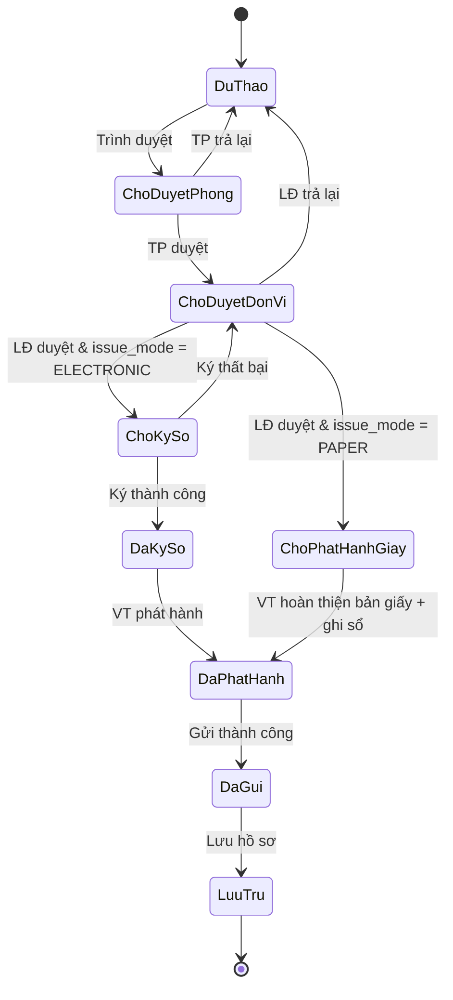

### Bảng quy tắc chuyển trạng thái công văn đi

| Trạng thái hiện tại | Hành động | Trạng thái tiếp theo | Ai thực hiện |
|---|---|---|---|
| Dự thảo | Trình duyệt | Chờ duyệt cấp phòng | Chuyên viên |
| Chờ duyệt cấp phòng | TP duyệt | Chờ duyệt cấp đơn vị | Trưởng phòng |
| Chờ duyệt cấp phòng | TP trả lại | Dự thảo | Trưởng phòng |
| Chờ duyệt cấp đơn vị | LĐ duyệt + phát hành điện tử | Chờ ký số | Lãnh đạo |
| Chờ duyệt cấp đơn vị | LĐ duyệt + phát hành giấy | Chờ phát hành bản giấy | Lãnh đạo |
| Chờ duyệt cấp đơn vị | LĐ trả lại | Dự thảo | Lãnh đạo |
| Chờ ký số | Ký thành công | Đã ký số | Lãnh đạo |
| Chờ ký số | Ký thất bại | Chờ duyệt cấp đơn vị | Hệ thống |
| Chờ phát hành bản giấy | Văn thư hoàn thiện bản giấy | Đã phát hành | Văn thư |
| Đã ký số | Phát hành | Đã phát hành | Văn thư |
| Đã phát hành | Gửi thành công | Đã gửi | Hệ thống |
| Đã gửi | Lưu hồ sơ | Lưu trữ | Văn thư |

> Lưu ý:
> - Khi TP hoặc LĐ trả lại dự thảo, hệ thống tự động tạo `document_version` mới để lưu bản cũ trước khi chuyên viên chỉnh sửa.
> - Khi LĐ duyệt cấp cuối, hệ thống phải cập nhật `approved_version_id` ngay trong cùng transaction với bản ghi `approval`.

---

# 9. Thiết kế API mức khái quát

> Phần này nhằm mô tả hướng thiết kế. Khi code thật có thể tinh chỉnh lại tên route.

## 9.1. Auth & User
- `POST /api/v1/auth/login`
- `POST /api/v1/auth/logout`
- `GET /api/v1/users/me`
- `GET /api/v1/users`
- `POST /api/v1/users`
- `PATCH /api/v1/users/{id}`

## 9.2. Danh mục
- `GET /api/v1/departments`
- `POST /api/v1/departments`
- `GET /api/v1/organizations`
- `POST /api/v1/organizations`
- `GET /api/v1/document-types`
- `GET /api/v1/document-books`

## 9.3. Công văn đến
- `POST /api/v1/inbound-documents`
- `GET /api/v1/inbound-documents`
- `GET /api/v1/inbound-documents/{id}`
- `PATCH /api/v1/inbound-documents/{id}`
- `POST /api/v1/inbound-documents/{id}/forward`
- `POST /api/v1/inbound-documents/{id}/ocr`
- `POST /api/v1/inbound-documents/{id}/assign`

## 9.4. Công văn đi
- `POST /api/v1/outbound-documents`
- `GET /api/v1/outbound-documents`
- `GET /api/v1/outbound-documents/{id}`
- `PATCH /api/v1/outbound-documents/{id}`
- `POST /api/v1/outbound-documents/{id}/submit-approval`
- `POST /api/v1/outbound-documents/{id}/sign`
- `POST /api/v1/outbound-documents/{id}/issue`
- `POST /api/v1/outbound-documents/{id}/dispatch`
- `GET /api/v1/outbound-documents/{id}/versions`

## 9.5. OCR
- `POST /api/v1/ocr/jobs`
- `GET /api/v1/ocr/jobs/{id}`
- `GET /api/v1/ocr/results/{id}`
- `POST /api/v1/ocr/results/{id}/accept`

## 9.6. Chữ ký số
- `POST /api/v1/signatures/sign`
- `POST /api/v1/signatures/verify`
- `GET /api/v1/signatures/document/{documentId}`

## 9.7. Search
- `GET /api/v1/search/documents`
- `GET /api/v1/search/fulltext`

## 9.8. Workflow & Phê duyệt
- `POST /api/v1/approvals` — Tạo yêu cầu phê duyệt
- `GET /api/v1/approvals/pending` — Danh sách chờ duyệt của người dùng hiện tại
- `POST /api/v1/approvals/{id}/decide` — Duyệt / Từ chối / Trả lại
- `GET /api/v1/documents/{id}/workflow-history` — Lịch sử luồng xử lý
- `POST /api/v1/workflow/assign` — Phân công người xử lý
- `GET /api/v1/documents/{id}/assignments` — Lịch sử phân công

## 9.9. File & Sổ công văn
- `POST /api/v1/documents/{id}/files` — Upload file đính kèm
- `GET /api/v1/documents/{id}/files` — Danh sách file của công văn
- `GET /api/v1/documents/{id}/files/{fileId}/download` — Tải file
- `POST /api/v1/document-books/entries` — Ghi sổ công văn
- `GET /api/v1/document-books/{id}/entries` — Xem sổ công văn
- `POST /api/v1/document-books/{id}/reserve-number` — Cấp số tạm/chính thức theo quy tắc sổ

## 9.10. Thông báo & Nhật ký
- `GET /api/v1/notifications` — Danh sách thông báo của người dùng
- `PATCH /api/v1/notifications/{id}/read` — Đánh dấu đã đọc
- `GET /api/v1/notifications/unread-count` — Số thông báo chưa đọc
- `GET /api/v1/audit-logs` — Xem nhật ký (chỉ admin)

## 9.11. Dashboard
- `GET /api/v1/dashboard/stats` — Thống kê tổng quan (số công văn theo trạng thái, theo tháng, etc.)
- `GET /api/v1/dashboard/my-tasks` — Công việc cần xử lý của người dùng hiện tại

## 9.12. Quy tắc chung cho API

**Pagination:** Tất cả API GET danh sách đều hỗ trợ:
```
?page=1&size=20&sort=created_at&order=desc
```

**Response chuẩn:**
```json
{
  "data": [...],
  "pagination": {
    "page": 1,
    "size": 20,
    "total": 150,
    "totalPages": 8
  }
}
```

**Error response chuẩn:**
```json
{
  "error": {
    "code": "VALIDATION_ERROR",
    "message": "Due date must be after issue date",
    "field": "due_date"
  }
}
```

---

# 10. Kiến trúc backend bên trong

## 10.1. Mô hình nhiều tầng

Mỗi module backend nên tổ chức theo 4 lớp:

1. **Controller / Handler Layer**
   - Nhận request/response HTTP
   - Validate dữ liệu đầu vào cơ bản
   - Gọi service

2. **Service Layer**
   - Chứa nghiệp vụ chính
   - Điều phối giữa repository, OCR, chữ ký số, workflow

3. **Repository Layer**
   - Truy cập cơ sở dữ liệu
   - Đóng gói câu truy vấn

4. **Integration Layer**
   - Gọi OCR engine
   - Gọi thư viện ký số
   - Gửi thông báo

---

## 10.2. Ví dụ luồng xử lý ở backend

### Nguyên tắc giao dịch và nhất quán dữ liệu
- Mọi thao tác làm thay đổi trạng thái hồ sơ phải nằm trong **một database transaction**.
- Trong cùng transaction phải đồng thời:
  - validate trạng thái hiện tại
  - validate version/file đang thao tác
  - ghi lịch sử (`workflow_step`, `approval`, `assignment`, `document_book_entry` nếu có)
  - cập nhật ảnh chụp hiện tại ở `documents`
  - ghi `audit_log`
- Với tác vụ bất đồng bộ như OCR/ký số, service cập nhật kết quả theo nguyên tắc **idempotent**:
  - chỉ cập nhật `documents` nếu job đang xử lý đúng file/version hiện tại
  - nếu job cũ hoàn thành muộn thì chỉ lưu lịch sử, không ghi đè trạng thái hiện tại

### Khi OCR một công văn đến
- Handler nhận file upload
- Service tạo `ocr_job`
- Integration gọi OCR engine
- Service nhận kết quả, lưu `ocr_result` và `ocr_extracted_fields`
- Service chỉ cập nhật `documents.accepted_ocr_result_id` sau khi người dùng xác nhận
- Audit log ghi nhận hành động

---

## 10.3. Quy tắc validation dữ liệu

Mỗi API cần validate dữ liệu đầu vào trước khi xử lý nghiệp vụ. Các ràng buộc quan trọng:

### Validation chung
| Trường | Ràng buộc |
|---|---|
| `code_number` | Không được trống khi phát hành; format gợi ý: `SỐ/KÝ HIỆU-ĐƠN VỊ` (ví dụ: `123/QĐ-ĐHCN`) |
| `title_summary` | Bắt buộc, tối đa 500 ký tự |
| `due_date` | Phải sau `issue_date` nếu cả hai đều có giá trị |
| `issue_date` | Không được là ngày trong tương lai |
| `document_type_id` | Phải tồn tại trong bảng `document_types` |
| `confidentiality_level_id` | Phải tồn tại trong bảng `confidentiality_levels` |
| `issue_mode` | Bắt buộc với công văn đi; chỉ nhận `PAPER` hoặc `ELECTRONIC` |
| `recipient_*` | Phải bảo đảm đúng một đích nhận trên mỗi dòng `document_recipients` |

### Validation theo trạng thái
| Trạng thái | Trường bắt buộc |
|---|---|
| Dự thảo | Chỉ cần `title_summary` |
| Trình duyệt | Cần đầy đủ: `title_summary`, `content_text`, `document_type_id`, `receiver`, `issue_mode` |
| Ký số | Phải có `approved_version_id`, file cần ký, certificate hợp lệ |
| Phát hành điện tử | Cần tất cả + `code_number`, file đã ký số, sổ cấp 1 `OFFICIAL` |
| Phát hành bản giấy | Cần tất cả + `code_number`, file lưu chiểu cuối cùng (nếu áp dụng), sổ cấp 1 `OFFICIAL` |

### Validation file upload
| Ràng buộc | Giá trị gợi ý |
|---|---|
| Kích thước tối đa | 50 MB/file |
| Loại file cho phép | `.pdf`, `.doc`, `.docx`, `.jpg`, `.png`, `.tiff` |
| Số file tối đa / công văn | 10 file |

---

# 11. Tìm kiếm và chỉ mục dữ liệu

## 11.1. Tìm kiếm theo metadata
Cho phép tìm theo:
- số công văn
- ngày gửi
- loại công văn
- đơn vị gửi
- đơn vị nhận
- mức độ mật
- mức độ khẩn
- trạng thái

## 11.2. Tìm kiếm theo nội dung
Cho phép nhập từ khóa tự nhiên để tìm trong:
- nội dung OCR
- nội dung tóm tắt
- nội dung chính

## 11.3. Gợi ý kỹ thuật
- Giai đoạn đầu: PostgreSQL full-text search
- Giai đoạn sau: Elasticsearch/OpenSearch

---

# 12. Bảo mật và kiểm soát hệ thống

## 12.1. Xác thực
- Đăng nhập bằng tài khoản hệ thống
- Mật khẩu băm bằng thuật toán an toàn (BCrypt hoặc Argon2)
- Sử dụng JWT với access token (thời hạn ngắn, ví dụ 30 phút) + refresh token (thời hạn dài hơn)
- Refresh token lưu trong HttpOnly cookie để chống XSS

## 12.2. Phân quyền
- **Role-based Access Control (RBAC):** Theo vai trò (admin, văn thư, lãnh đạo, chuyên viên)
- **Resource-based Access Control:** Kiểm tra quyền trên từng công văn cụ thể
- **Department Scoping:** Văn thư phòng A không xem được sổ phòng B
- **Confidentiality Enforcement:** Kiểm tra `confidentiality_level` trước khi trả dữ liệu

### Ma trận quyền chi tiết

| Vai trò | Quy tắc truy cập công văn |
|---|---|
| Quản trị | Xem tất cả (bao gồm audit log) |
| Văn thư đơn vị | Xem tất cả công văn của đơn vị mình |
| Lãnh đạo đơn vị | Xem tất cả công văn của đơn vị mình |
| Văn thư phòng/ban | Chỉ xem công văn của phòng/ban mình |
| Trưởng phòng | Chỉ xem công văn được chuyển đến phòng/ban mình |
| Chuyên viên | Chỉ xem công văn được phân công trực tiếp |

## 12.3. Bảo vệ file
- File công văn không lưu public URL tùy tiện
- Chỉ người có quyền mới tải được (kiểm tra JWT + quyền trước khi trả file)
- File mật cần chính sách truy cập riêng
- Đường dẫn file dùng UUID hoặc hash, không dùng tên gốc để tránh enumeration attack

### Mã hóa file mật (Encryption at Rest)

Công văn có mức độ mật (`TỐI MẬT`, `TUYỆT MẬT`) cần được bảo vệ ở tầng lưu trữ:

| Mức độ | Chính sách lưu trữ |
|---|---|
| Thường | Lưu file bình thường, kiểm soát quyền truy cập qua API |
| Mật | Mã hóa file bằng AES-256 trước khi ghi ra disk. Key quản lý tập trung |
| Tối mật / Tuyệt mật | Mã hóa AES-256 + tách thư mục riêng + audit log chi tiết mỗi lần truy cập |

**Ghi chú:**
- Trong bản demo/thử nghiệm, có thể mô phỏng mã hóa bằng cách sử dụng thư viện mã hóa có sẵn (ví dụ: `cryptography` trong Python, `javax.crypto` trong Java).
- Key mã hóa nên được lưu riêng biệt với file dữ liệu (không đặt cùng thư mục).
- Bảng `document_files` bổ sung cột `is_encrypted` (boolean) để biết file nào đã được mã hóa.

## 12.4. Nhật ký hệ thống
- Ghi log hành động quan trọng (tạo, sửa, xóa, duyệt, ký, tải file)
- Ghi `ip_address` của người thực hiện
- Hữu ích cho kiểm tra và bảo vệ đề tài
- Log không được xóa, chỉ append-only

## 12.5. Chống tấn công cơ bản
- **CSRF:** Sử dụng CSRF token cho các thao tác ghi (POST, PATCH, DELETE)
- **XSS:** Escape output, Content-Security-Policy header
- **SQL Injection:** Sử dụng parameterized queries / ORM
- **Rate Limiting:** Giới hạn số request/phút cho API login và OCR

---

# 13. Phương án triển khai thử nghiệm

## 13.1. Công nghệ gợi ý
Vì đề tài là hệ thống Web thử nghiệm, nhóm có thể chọn stack quen thuộc. Một phương án dễ triển khai:

### Frontend
- ReactJS hoặc VueJS

### Backend
- ASP.NET Core / Spring Boot / Node.js / Laravel  
> Tùy nền tảng nhóm thành thạo, nhưng cần giữ kiến trúc tách lớp rõ ràng.

### Database
- PostgreSQL hoặc MySQL  
> PostgreSQL được ưu tiên nếu muốn tận dụng full-text search tốt hơn.

### OCR
- Tesseract OCR
- EasyOCR hoặc PaddleOCR để so sánh/chạy thử

### Chữ ký số
- Thư viện ký PDF hoặc mô phỏng PKI để trình diễn quy trình ký/xác minh

### File storage
- Lưu local trong demo
- Có cấu trúc thư mục rõ ràng theo năm/tháng/loại

---

## 13.2. Đề xuất môi trường triển khai demo

### Mô tả
- Frontend: 1 server/node
- Backend API: 1 server/node
- Database: PostgreSQL/MySQL
- OCR engine: chạy cùng backend hoặc service riêng
- Signature module: chạy cùng backend hoặc service riêng
- Object/File storage: thư mục cục bộ

### Deployment Diagram

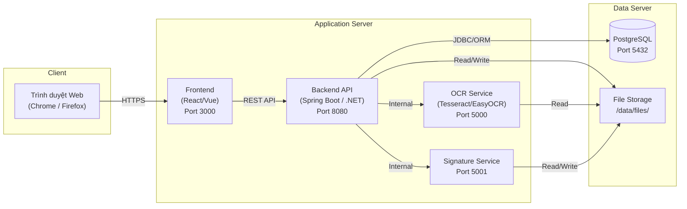

> **Ghi chú:** Trong bản demo, tất cả các thành phần có thể chạy trên cùng một máy. Khi triển khai thực tế, OCR Service và Signature Service có thể tách thành container/service riêng.

---

# 14. Hướng chia việc cho nhóm

Dựa trên 8 thành viên, có thể chia như sau:

## Nhóm 1: Nghiệp vụ + tài liệu + UML
- Phân tích quy trình công văn đến/đi
- Viết use case, activity, sequence
- Viết tài liệu báo cáo

## Nhóm 2: Backend core
- Users
- Danh mục
- Documents
- Workflow
- API

## Nhóm 3: OCR + chữ ký số
- Tiền xử lý ảnh
- OCR pipeline
- Mapping kết quả OCR
- Tích hợp ký số/xác minh

## Nhóm 4: Frontend + tìm kiếm + demo
- Form nhập liệu
- Danh sách và chi tiết công văn
- Màn hình OCR
- Màn hình ký số
- Tìm kiếm và báo cáo demo

---

# 15. Kịch bản demo khi bảo vệ

Một kịch bản demo tốt nên đi theo đúng luồng nghiệp vụ:

## Kịch bản 1: Công văn đến
1. Văn thư tạo công văn đến
2. Upload file scan
3. Hệ thống OCR bóc tách
4. Người dùng xác nhận metadata
5. Ghi sổ cấp 1
6. Chuyển lãnh đạo/phòng ban
7. Theo dõi trạng thái xử lý

## Kịch bản 2: Công văn đi
1. Tạo dự thảo công văn đi
2. Trình duyệt
3. Ký số file PDF
4. Ghi sổ
5. Đánh dấu phát hành
6. Tra cứu lại bằng số công văn hoặc nội dung

## Kịch bản 3: Tìm kiếm
1. Tìm theo số công văn
2. Tìm theo từ khóa nội dung
3. Lọc theo loại công văn, ngày, phòng ban

---

# 16. Điểm mạnh học thuật và thực tiễn của kiến trúc này

## 16.1. Về học thuật
- Kết hợp 2 công nghệ cốt lõi: OCR và chữ ký số
- Có workflow quản lý tài liệu thực
- Có mô hình dữ liệu rõ ràng
- Có khả năng đánh giá hiệu quả so với quy trình thủ công

## 16.2. Về thực tiễn
- Phù hợp nghiệp vụ văn thư
- Có thể dùng để số hóa quy trình công văn
- Dễ phát triển thành hệ thống thật sau đề tài

---

# 17. Những điểm cần lưu ý khi bảo vệ

1. Không nên nói OCR chính xác tuyệt đối.
   - Nên nói: hệ thống hỗ trợ bóc tách bán tự động, có bước xác nhận lại.

2. Không nên nói hệ thống thay thế toàn bộ quy trình pháp lý thực tế.
   - Nên nói: đây là hệ thống thử nghiệm phục vụ nghiên cứu và minh họa mô hình tích hợp.

3. Nên nhấn mạnh:
   - bài toán thực tế
   - khoảng trống nghiên cứu
   - luồng xử lý công văn đến và đi
   - cơ sở dữ liệu tập trung
   - vai trò của chữ ký số
   - khả năng mở rộng AI về sau

---

# 18. Kết luận

Kiến trúc được đề xuất trong tài liệu này nhằm giải quyết đồng thời ba yêu cầu lớn của đề tài:

1. **Quản lý công văn đi và đến theo đúng hướng nghiệp vụ**
2. **Tăng mức tự động hóa nhờ OCR**
3. **Bảo đảm xác thực và toàn vẹn tài liệu điện tử nhờ chữ ký số**

Cách tổ chức hệ thống theo mô-đun giúp:
- cả nhóm dễ triển khai
- giảng viên dễ theo dõi
- hội đồng dễ đánh giá logic
- hệ thống dễ phát triển mở rộng

Tài liệu này có thể được dùng như:
- bản định hướng kỹ thuật cho nhóm
- bản giải thích kiến trúc trong báo cáo
- cơ sở để vẽ tiếp UML, ERD và slide bảo vệ
- tài liệu tham chiếu khi code backend, frontend và cơ sở dữ liệu

---

# 19. Phụ lục: sơ đồ rút gọn để thuyết trình nhanh

## 19.1. Sơ đồ luồng giá trị hệ thống

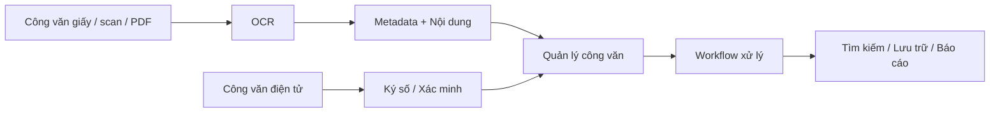

## 19.2. Sơ đồ module cốt lõi

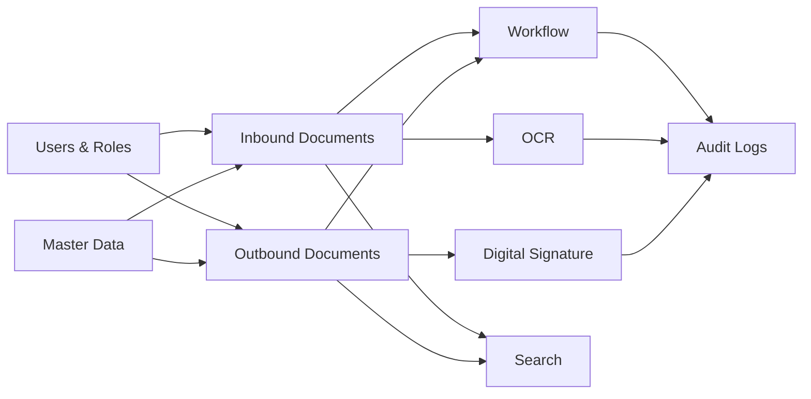
